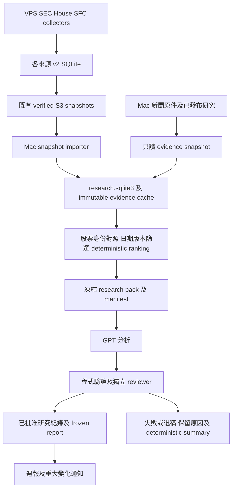

# SmartFlow Mac mini GPT 研究架構方案

日期：2026-10-08。狀態：Draft，供 Tommy 審閱；未批准實作或部署。

建議先保留 VPS 收集同 S3 snapshot，喺 Mac mini 加一個獨立研究層：每日整理新證據，持續更新每隻股票嘅研究紀錄，每週交一份值得睇嘅重點報告。GPT 負責解釋、比較同提出可驗證假說；固定程式負責資料身份、數字、來源健康、研究排序同交付。

搬 collector 去 Mac mini 係後續可選項。Holistic analysis 首先需要同一股票嘅跨來源身份、時間線、矛盾證據同持續研究記憶。現有 SEC 日報只涵蓋最近 24 小時，未能解決你隔幾日先睇一次嘅需要。

## 你會收到嘅研究結果

每週報告第一頁回答四件事：邊幾隻股票值得跟、今次有咩新證據、同上次睇法有咩不同、仲欠邊個關鍵事實。最多五隻重點股票，每隻一段摘要；詳細證據同未完成研究留喺本地。

每日研究有結果亦可以唔寄信。額外通知只喺已驗證嘅重大變化、原先假說受反證、或資料源故障影響判斷時觸發。相同證據唔重複提醒，週報保留上次成功交付之後嘅全部未報變化；你幾日冇睇都唔會只見最後一日。

例如一個合成個案：兩位 insider 有 purchase 披露，House PTR 後來披露同一股票 sale，另一份 Form 144 只表示 proposed sale。研究結果應分開實際披露、延遲交易同出售意向，解釋支持同矛盾，列出要查嘅 earnings 或交易背景。唔可以將三種資料相加做即時資金流，亦唔可以將新聞時間相近當成因果關係。

## 現有系統同可用資料

| 部分 | 今次確認到嘅狀態 | 對方案嘅影響 |
|---|---|---|
| SEC Form 4 及 Form 144 | 已有 isolated v2 DB、每日 snapshot、SEC-only decision pack 同 MiniMax owner brief；10 月 8 日 07:55 HKT pack 兩個來源顯示 healthy | 可以沿用原始證據同 publisher；新研究層需要完整歷史同額外身份欄位 |
| House Congress PTR | 已部署獨立 shadow；10 月 8 日 07:47 HKT 有新 S3 snapshot；未接正式 owner brief | 先核對目前 audit、可靠性同 parser 合約，再喺獨立 prototype 使用 |
| SFC short positions | 已部署獨立 shadow；最新 S3 snapshot 生成於 10 月 4 日 19:07 HKT | 只能做香港 short-position context；snapshot 年齡同 weekly publication freshness 分開判斷 |
| 跨來源股票 ranking | `smartflow/equity_intelligence.py` 已有 deterministic stance 同 research priority；未接 production | 可重用分類思路，先補 identity、版本同日期 adapter |
| 香港新聞 workflow | Mac 08:00 HKT LaunchAgent 已載入，今次 readback 顯示 idle、last exit 0；有原件、歷史、review 同 frozen delivery | 可以參照 execution pattern，同讀取相關新聞證據 |
| Mac mini | arm64、16 GiB RAM、約 127 GiB 可用磁碟；Codex CLI `0.158.0-alpha.2.1` | 足以作 Python／SQLite orchestration 嘅初步條件；GPT 推理喺 OpenAI 服務，唔係 Mac 本地模型 |

以上 S3 metadata 唔等於完整 live collector audit。今次下載指定版本嘅 SEC pack，SHA-256 與 S3 metadata 相符；未下載及驗證三個完整 DB，亦未觸發任何 collector、GPT 分析或寄信。

現階段可承諾嘅覆蓋係 US SEC、待驗收嘅 House evidence，同 HK SFC context。13F、13D/G、HK director、price／volume／regime 舊 collector 全部仍受現行停用或 release gate 限制。CCASS、HKEX DI 同 issuer automation 保留既有授權資料路線 gate；crypto／CoinGlass 仍在 scope 外。

香港新聞系統主力係政策、法律同公民議題，唔等於完整美股 issuer、earnings、sector 或 macro coverage。第一期可以連相關 HK context；完整美股市場背景要喺後續另加有來源合約嘅 connector，唔會喺報告冒充已覆蓋。

## 三個部署選項

| 選項 | 好處 | 代價 | 判斷 |
|---|---|---|---|
| VPS 收集，Mac 研究 | 沿用現有持續收集、備份同來源合約；Mac 停機時上游仍可收集；可獨立驗收 GPT 報告 | 要同步 snapshot；有兩部機嘅運作狀態 | 建議第一期 |
| 全部搬 Mac | runtime 集中，collector 同研究直接讀本地資料 | 受開機、登入、睡眠、家用網絡影響；Linux wrapper 同鎖要改寫；要切換唯一 writer | 研究層有用後再決定 |
| 全部保留雲端，改 GPT | 持續運作較少依賴家中設備 | 另做 GPT API runner、憑證、用量預算同交付；未沿用現有 Mac 執行方式 | 日後若需要更強運作保障再比較 |

Mac research project 建議放喺 `/Users/vortex/Applications/smartflow-research/`，source module 喺現有 SmartFlow repository 維護，使用獨立 venv、`research.sqlite3`、locks 同 run folders。唔共用新聞資料庫嘅 writer 或覆蓋現有 SEC brief schema。

## 資料流同職責

同步、研究同交付分開記錄成功狀態。一輪 GPT 失敗唔會令匯入資料消失；一份週報未送達亦唔會推進交付水位。原件 snapshot、每輪輸入同 approved report 都有固定 hash，之後可以重現「當時睇到咩」。

## Snapshot 同新聞接口

SmartFlow importer 只接受三個既有 DB key：`beta/sec-v2-shadow.db`、`beta/congress-house-v2-shadow.db`、`beta/sfc-short-v2-shadow.db`。SEC pack 可以作 quick health／summary reference，但完整研究記憶以經驗證 DB 為準。

一次匯入按以下順序：HEAD exact key → 記錄 VersionId／hash／generated-at → GET 指定 VersionId → 驗證 size、SHA-256、schema、foreign keys、source isolation → 以唯讀方式讀入 → 一個 transaction 更新 import ledger → 原子發布 cache。唔使用 ETag 代替 SHA-256；hash 驗證證明傳輸一致性，唔取代原始披露來源核實。

SEC DB 同 decision pack 分開上載，並非 atomic pair。若同時使用兩者，pack 內 `snapshot_sha256` 必須同 DB 相符；唔可以任取兩個 latest object 就認定一致。各来源 snapshot 有自己 cutoff，報告顯示每個 cutoff，唔聲稱所有資料來自同一秒。

初次匯入做完整身份對照；之後 VersionId 未變就跳過下載，已變就按 stable event identity／parser version／hash 做差分。唔只用 integer ID 或 observed-at 水位，因為 parser reprocessing 可以新增舊披露嘅 children。Source-local raw ID 保留 namespace，唔直接當研究 DB primary key。Immutable identity 遇到新 hash 要 quarantine，唔覆寫舊證據。

現有 publisher 只喺健康狀態上載，所以來源失敗時 S3 可以留低一份舊 healthy snapshot。Importer 必須重算 freshness，顯示 `health_as_of` 同「目前狀態未知」。要即時區分 publish failure 同冇新披露，第二期應另加細小 health receipt，無論 success／failure 都發布 last attempt；呢個係新增上游介面，需要獨立部署及 IAM manifest。

新聞接駁由 SmartFlow 固定程式用 SQLite `mode=ro` transaction 或一致 backup 讀 metadata，再複製需要嘅 immutable 原件／submission，驗證 raw、text 同 manifest hash，凍結喺自己 run。唔 raw-copy 正在寫入嘅 SQLite main file，唔呼叫 production `Store` 或 `history-search`／`history-matches`／`history-timeline`：現有 CLI 會同步並修改派生 history tables。

引用已發布研究時，必須由 `publications` 指向確切 submission，將 `submission-manifest.json` hash 對照唯讀 DB `submission_integrity.manifest_hash` 嘅 pinned digest，核對正式 review 綁定同一 `analysis_sha256` 同 `submission_manifest_sha256`，再驗證每個 artifact hash。只驗 manifest 同 files 自身一致，未能證明佢係原先批准版本；missing 或不相符就拒絕匯入該分析。

每份引用保留 origin project、document／publication ID、URL、原件 hash、quote／page 同日期。Newsroom review 通過嘅文章係 secondary analysis；新投資推論要重新 review，重要事實仍追返原件。相關原件可以納入，即使未成為已發布文章；但 draft／rejected analysis 唔會成為可信歷史結論。若匯入 `history_links`，一律保留 `status=hypothesis`，唔升級成 fact。新聞 DB 唔會被 SmartFlow 寫入。

## 股票身份同證據語意

目前 SEC `security_id` 係 issuer CIK，House 係 `US:{ticker}`，SFC 係 `HKEX:{code}`。直接套現有 ranking 會將 SEC 同 House 同一股票拆開。研究層要建立內部 `security_key`，分清 issuer、listing、share class，同保存有生效日期嘅 CIK／ticker aliases、mapping evidence 同版本。

CIK 只識別 issuer，唔保證同一 share class。裸 ticker 或公司名相似唔足以自動合併；未能核對嘅資料留 `UNRESOLVED`，唔計跨來源共識。第一期可以由細量、可覆核 alias table 起步，唔需要全市場 identity vendor。

Raw event 保存 `(source, source_event_id, payload_hash)`；normalized evidence 保存 `(source, source_event_id, parser_version)`。Research view 按批准 parser policy 揀有效版本，保留被替代版本供 audit。先做 quality gate 再 ranking；現有 ranking 接受 warning，而且唔按 parser version 去重，唔適合直接食完整 snapshot。

| 來源 | 研究層可用解讀 | 必須保留嘅限制 |
|---|---|---|
| Form 4 | trusted v4、valid non-derivative P／S purchase／sale evidence | gift、award、exercise、行政 notice 同 derivative 唔當一般 open-market 買賣 |
| Form 144 | proposed sale context | 唔等於已執行；future proposed date 要留喺計劃時間線 |
| House PTR | 已披露 purchase／sale，owner 同金額 range | 交易、通知、披露日期分開；唔把 range midpoint 或下限當 exact trade value |
| SFC | weekly aggregate reportable net-short position 及 comparable-week delta | 匿名 snapshot；缺席唔等於零／平倉；HK context 本身唔創造買卖 stance |
| 新聞 | 已核實事實、相關政策／公司背景、可追溯推論 | 多間媒體轉載同一來源唔算多份獨立證據；相關性唔等於因果 |

Actor count 按真實身份同來源去重，同一人多筆交易唔變多個獨立 actor；multi-owner filing 唔重複 transaction value。無可核實 actor ID 時列 unknown，唔用每個 event ID 冒充新 actor。Source agreement 同 actor agreement 分開呈現。

日期最少保留 `event_at`、`filed_at`、`observed_at`、`imported_at`，另外記錄有證據支持嘅 `public_available_at`。系統首次收集唔等於首次公開；無法證明 earliest publication 時標 unknown。未來 backtest 以可證明當時已可取得嘅資訊做 cutoff，唔將後來補入嘅舊交易倒放入歷史。

現有 ranking 用 event-at 做 age gate，亦會丟棄未來 event-at；新 adapter 要分開近期新披露、舊交易脈絡同 proposed-sale calendar。唔修改原日期去遷就 ranking。可沿用 stance／priority 分類，但合約調整要先過 source-specific regression。

## 研究記憶同 GPT 工作邊界

使用 SQLite 加 immutable files，第一期唔需要 vector database、Kafka、Redis 或常駐 agent swarm。Structured key／date 查詢加 keyword retrieval 起步，FTS 要先實測中英文檢索，唔假設預設 tokenizer 適合中文；新研究 DB 自己持有派生 index。

| 紀錄 | 主要內容 |
|---|---|
| Import ledger | 每 source VersionId、hash、cutoff、import outcome、row reconciliation |
| Security aliases | issuer／listing／class identity、日期、mapping evidence、版本 |
| Evidence references | source identity、parser、原件 hash、日期、quality、數字及 range |
| Research runs | manifest、code／prompt／schema／model config、輸入 scope、review outcome |
| 股票研究版本 | 問題、支持／反證 IDs、假說狀態、上次 approved version、未解決缺口 |
| Follow-up tasks | 具體待查問題、due／blocked／done、嘗試結果、重試條件 |
| Report outbox | frozen bytes／hash、週期、delivery identity、確認結果 |

三條水位分開：已匯入、已分析、已交付。失敗、退稿或未確認寄送唔會跳過應研究／應交付項目。首次完整歷史 bootstrap 係背景，唔逐筆當今日新 alert；parser 更新亦唔自動當新交易。每輪用 bounded dossiers，保留 excluded／not-reviewed counts，同較舊待查問題嘅輪候位置。

固定程式先生成 `research-pack-v1`：最多五個股票 dossier、每個新證據及 30／90 日脈絡、上一個 approved 假說版本、support／counterevidence、來源健康同三個 focused follow-ups。日報期間除重點外嘅 evidence 仍留 DB，唔因 prompt limit 刪除。

GPT 輸出分 `FACT`、`INFERENCE` 同 `OPEN_QUESTION`，每項用 stable evidence IDs。可以比較證據、解釋披露遲滯、提出 alternative explanation、建議下一個要查嘅事實。數字、stance、research priority 同 source semantics 由程式生成；GPT 唔改分數、挑選交易或創造缺失資料。任何新增分析自由度，需正式修訂現有「LLM 只敘述批准事實」產品合約，而唔靜默放寬。

上一輪 AI prose 係可推翻假說，唔係新 fact。Report 必須帶一個有實質內容嘅「同上次有咩唔同」，包括 unchanged、contradicted 同 pending；無新材料就唔勉強寫新 thesis。未核實假說唔因重複出現而升級成事實。

## GPT 執行同驗證

第一期沿用 Mac 現有 ChatGPT-authenticated Codex CLI 模式。Newsroom 現用 `gpt-5.6-sol/high`，新研究層可將同一設定作初始候選，但正式啟用前要做 account／model canary 同 representative report eval；唔自動跟 latest，唔因 CLI exit 0 就當分析完成。

OpenAI 官方文件支持用 `codex exec` 做 scheduled pipeline，並提供 JSONL 同 `--output-schema`；saved CLI authentication 可重用。[Non-interactive mode](https://learn.chatgpt.com/docs/non-interactive-mode)

分析器同 reviewer 係兩個分開 context 嘅實際 GPT execution；同一模型提供 procedural independence，唔等於兩種獨立模型或真確保證。Fixed validator 先核對 schema、引用存在、日期、數字同 range 一致，reviewer 再睇推論、反證、時序同缺口。最多一次修正，仍失敗就保留 deterministic summary，同明確標示未完成 GPT review。只有 approved 版本進入研究記憶嘅正式結論。

對資料內容一律視作 untrusted evidence，唔執行原件入面嘅指令。建議 analyst 同 reviewer 用 read-only sandbox，由外層程式收 JSON 同寫研究 state。模型唔持有 S3 writer、collector credentials 或 mail execution 職責；需要補資料時只提交 bounded fetch request，由固定 connector 另行取得再驗證。

Read-only sandbox 唔代表所有 filesystem reads、plugins 或 inherited credentials 都自然隔離。實作前要驗證 exact CLI profile、工具 allowlist、環境傳遞同 approved input folder；最初唔授予新聞專案 GWS writable root。新增 permissions／credential route 屬 security-critical，先呈現具體 manifest 同影響再獲批准。

ChatGPT subscription 同 API key 係兩種 billing／auth route。官方以 API key 作 automation 嘅一般預設；沿用現有專用 Mac account 有實際先例，但唔承諾永久無人值守或任意用量。Authentication／quota failure 要停止、保留 ledger，同通知 operator；唔自動換 API、model 或重新登入。[Authentication](https://learn.chatgpt.com/docs/auth)、[Non-interactive mode](https://learn.chatgpt.com/docs/non-interactive-mode)

## 排程同交付

Prototype 先手動 report-only。批准 daily runner 後，建議 07:58 HKT 做 lightweight snapshot sync，10:45 HKT 做研究，星期六 11:30 HKT 生成週報。呢啲係建議時段；SFC snapshot 目前喺 19:07 HKT 發布，朝早研究會用前一個已發布版本，唔假裝包含未到嘅資料。

新聞原有 08:00／90 分鐘 budget 同 SmartFlow 自己嘅 run lock 分開。錯開時間有助減少重疊，但唔係可靠互斥。排程啟用前，要批准兩個 runner 一齊遵守嘅 shared GPT slot；SmartFlow 遇到新聞持有 slot 就 defer。只加 SmartFlow lock 而新聞唔使用同一鎖，唔可以聲稱已防止全機 model concurrency。手動任務、catch-up 同 quota 一樣納入 run budget。

建議每輪 SmartFlow 研究最多 45 分鐘、一次修正、一次 daily attempt；transport failure 有有限重試，uncertain model／delivery state 必須先 reconciliation。每輪保存 phase、reason code、last success 同下次檢查条件；唔清 ledger 冒充未執行。Mac sleep／logout／offline 時保留上游收集同未處理 backlog，恢復後按 cutoffs 做一次 bounded catch-up。

Weekly report 同重大變化通知共用一個 frozen outbox 合約：review 綁定最後正文、subject 同 manifest；交付由固定程式核對收件人，同 provider receipt／Sent readback。Delivery identity 用 report period、report hash 同 channel；「已嘗試但未確認」唔盲目重寄。Prototype 冇自動 send；正式 mail route 要另批准，唔直接借用新聞嘅既有授權範圍。

重大變化嘅初始 triggers 用 deterministic evidence delta 定義，例如研究 stance 改變且有新有效證據、distinct-actor confirmation 新增、reviewed 假說被新反證推翻。Threshold 只決定通知必要性，唔宣稱投資勝率。一般 health incident 同 recovery 各提醒一次，與股票研究通知分開。

## 用量成本同保存

今次三個 full DB 合共 284,872,704 bytes，約 271.7 MiB。假設每日全部重新下載而大小不變，30 日約 8.55 GB；係傳輸規劃估算，唔係 AWS 帳單。Importer 做 VersionId checkpoint；日後如 source 增長令 full scan／download 成為瓶頸，再設計 incremental export，唔預先引入 streaming infrastructure。

研究層初始唔新增每月固定 LLM API 費，但會消耗 ChatGPT allowance，同帳戶嘅其他任務共用容量，可能涉及 credits。Prototype 記錄实际 input／output／reasoning usage、wall time、repair 次數同 quotas，先量度再决定可負擔 frequency。唔用 API token price 換算 subscription 包含幾多研究輪次。[Pricing and usage](https://learn.chatgpt.com/docs/pricing)

若每天都有新證據，analyst 加 reviewer 最多約 60 次 execution／30 日，加四份週報約八次；呢個只係初始 workload 假設，唔係 token cap、帳戶容量或固定成本。有 health／evidence delta 先啟動 daily GPT，無變化由程式記錄 no-change。另預留最多一次修正成本，唔用背景 agent 無限深挖。

Local cache 建議保留 latest verified snapshot 同有 approved report 引用嘅版本；normalized research history、manifest、approved conclusions 同最少所需原件繼續可重現。完整研究 run 備份用 SQLite backup API，配合 immutable files manifest。新 cache retention／清理規則須另列 exact scope；唔自動刪任何既有 S3 snapshot 或 pre-existing 本地資料。

Mac research 壞咗可以由 versioned source snapshot 重建 facts，但研究假說、task state、approved history 同 delivery ledger 係獨有 state，必須另做 off-host backup 同一次實際 restore rehearsal。第一期研究-only 可先用保留副本；正式排程驗收前要決定並批准 exact backup destination、credentials 同 retention。

## 分階段實作同驗收

| 階段 | 具體交付 | 完成條件 |
|---|---|---|
| 0 審閱方案 | 呢份 architecture、範圍、邊界同驗收要求 | 你選定第一期方向；未部署 |
| 1 手動研究 prototype | Exact-version snapshots importer、security aliases、research DB、五股票 pack、GPT＋review、一份本地報告 | 真實 cross-source join、矛盾 evidence、日期／range 正確；零 source mutation／send；House／SFC source gate 另核對 |
| 2 研究連續性 | Approved history、due tasks、每輪 delta、至少七個研究日試行 | 唔漏未分析 evidence、唔重複 false actor／交易、能講清上次結論變化；量到真實容量及 latency |
| 3 排程週報 | Shared GPT slot、launchd ledger、health receipts、backup／restore、frozen outbox | 實際 calendar trigger、timeout／quota／offline 演練、一次真實週報交付及重播防重寄 |
| 4 擴展資料 | 有權使用嘅 US issuer／earnings／macro context；視需要補 HK actor evidence | 各 connector 個別 source contract、public-availability 日期、health 同許可驗收 |
| 5 可選 collector 遷移 | 經驗證 Mac collector，同現有上游 writer 切換 | 停舊 writer 再啟新 writer、反向 rollback、原件／row identity 相符、完整 schedule window 通過 |

第一期 module 應保持細：snapshot importer、identity／evidence adapter、research store／pack builder、GPT runner／review gate、manual CLI。沿用現有 `smartflow.db.snapshots`、health 同 source-specific reconciliation；只借用 owner-brief validation pattern，唔擴充正式 SEC-only schema。未有實際需要前唔建 dashboard 或公共 API。

至少驗收以下 failure／edge cases：同 ticker 不同 share class、同 issuer 不同 listing、同一 actor 重複交易、舊 parser 同新 parser 同時存在、missing ticker／OCR／amendment、late disclosure、future Form 144、SFC missing row、fresh download 但 stale source、舊 healthy snapshot、SEC pack／DB mismatch、hash conflict、newsroom 同時寫入、GPT 未知 evidence ID／range 中點、reject／timeout／quota／登入失效、run 重播同 delivery uncertain。

Report 品質用真實少量代表性 dossier 人工判斷：每個 factual claim 可追源、counterevidence 無遺漏、沒有 unsupported 因果、prior conclusion 有實質比較、五個摘要易讀。呢啲係產品驗收；唔當作已證明 alpha。未來任何收益／預測能力聲稱仍需原有 time-separated outcome gate。

全搬 Mac 要另外處理 Linux `flock`／`/usr/bin/python3`／hardcoded VPS paths、Python／PDF runtime parity、唯一 collector lock、既有 S3 uploader 同 reporter 依赖。Shared VPS 仲有其他服務，所以唔會因 SmartFlow 遷移就關機或取消資源。Collector cutover 必須先保留一致 snapshot、before-state 同 rollback；同一來源唔同時喺 Mac／VPS 寫入兩套權威歷史。

## 審閱時要決定嘅三件事

1. 是否同意先做 hybrid research layer，同先交付一份本地真實報告，再决定正式週報同 collector 遷移。
2. 第一份報告是否接受 US SEC＋經 gate 核對嘅 House 作核心，HK 先顯示 SFC context 同 actor data gap；相關香港新聞只作已有覆蓋。
3. 是否接受沿用現有 Mac ChatGPT account 作 prototype，量度用量後先决定 production auth／model 同 frequency。

其餘例如 signal lookback、packet cap 同時段已有以上初始建議，唔需要你逐個填 optional parameter。權限、來源啟用、排程同寄送會喺相應階段以實際 manifest 審閱，唔由批准研究方案一次過擴張。

## 來源同核對紀錄

本地基線：SmartFlow `0446dfb3559d3a453abecce9ee4564801f1fe0f8`，branch `security/observation-window-20260902`；newsroom `b5e5b1a`。兩個 working tree 喺研究開始時 clean；保留 SmartFlow 未完成 DevSecOps observation handoff。

重要 source modules：`smartflow/db/models_v2.py`、`smartflow/db/snapshots.py`、`smartflow/normalizers/sec.py`、`smartflow/normalizers/congress.py`、`smartflow/equity_intelligence.py`、`smartflow/sfc_reconciliation.py`、三個 `ops/publish_*snapshot/shadow.py`、`lambda/owner_brief.py`、`lambda/beta_report.py`。產品限制見 `STOCK_FIRST_PRODUCT_SPEC.md`、`PROJECT_PLAN.md` 同現行 `AGENTS.md`。

新聞接口核對：`scripts/mac-run.sh`、`scripts/mac_daily.py`、`newsroom/history.py`、`newsroom/scheduler.py`、`DAILY_AUTOMATION.md` 同 `AI_HANDOFF.md`。Mac 只讀 SSH 核對 hardware、CLI help 同 launchd readback，冇執行研究或改設定。

| S3 key | 指定／觀察版本 | bytes | generated-at UTC |
|---|---|---:|---|
| `beta/sec-v2-decision-pack.json` | `6IkDuGH06sOSDjT_WFkm.oP2PtdXhril` | 293,970 | 2026-10-07 23:55:06 |
| `beta/sec-v2-shadow.db` | `Pm9H6wKdrAMHlXoPGOQDu0Bpy1h_Q8bs` | 206,163,968 | 2026-10-07 23:55:06 |
| `beta/congress-house-v2-shadow.db` | `LXrjkd1z1Jfgp_ZqQAyZNMzG9HW.zc4n` | 55,058,432 | 2026-10-07 23:47:01 |
| `beta/sfc-short-v2-shadow.db` | `bWitnHR4KZ2ZXTsUNxs.UxPr8ODQloYO` | 23,650,304 | 2026-10-04 11:07:01 |

下載 SEC pack 嘅 SHA-256：`a5cb197dc587e854c9392e077f79282ae90803f528e64cadfb59c4f85845c743`，與 object metadata 相符；pack 引用 DB hash：`f9879ae8912aff7c1471a13b70c99aa94b7bb0cf5c9b1e8a3bb96b8c55a71b46`，同 SEC DB HEAD metadata 相符。Pack 兩來源 state 為 healthy 只反映該生成時刻，唔延伸成今日全天健康保證。

官方 OpenAI docs 核對日期：2026-10-08。本文引用嘅 CLI／auth／usage 行為仍要以部署時實際版本及帳戶驗收為準。
